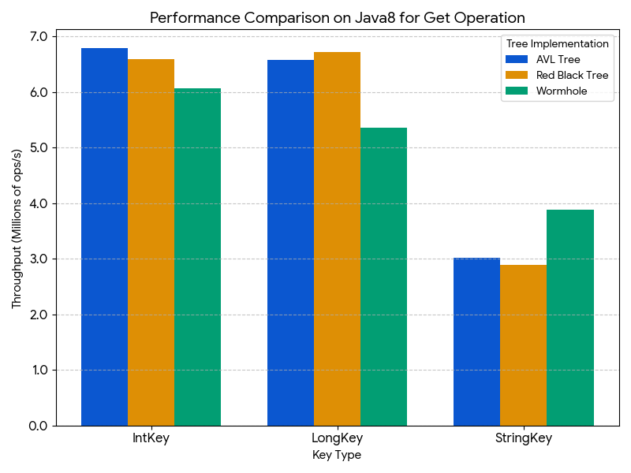
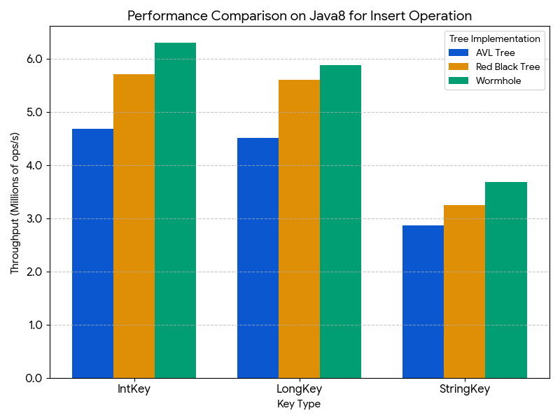
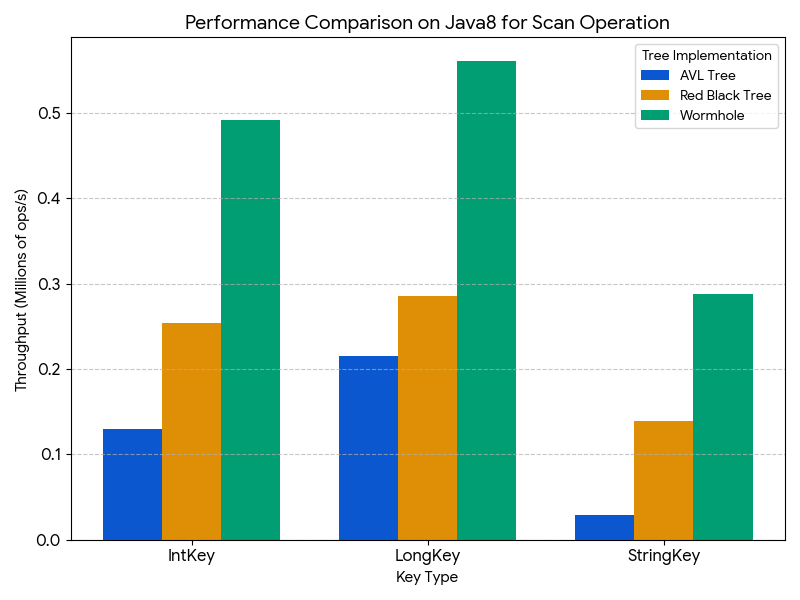
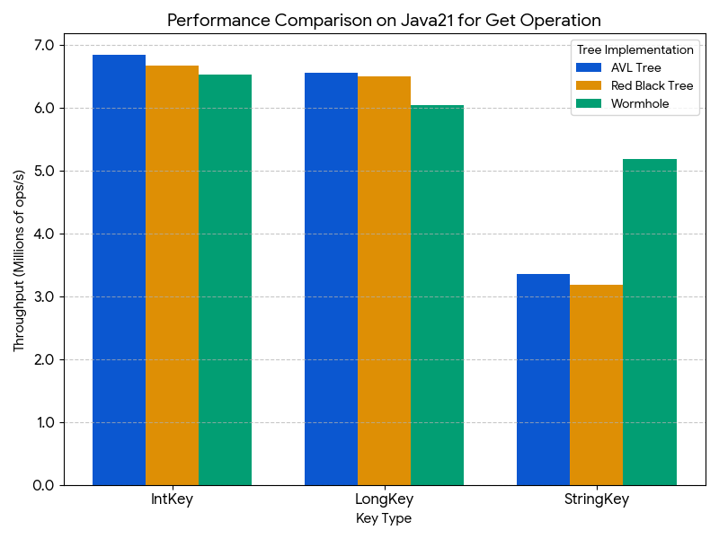
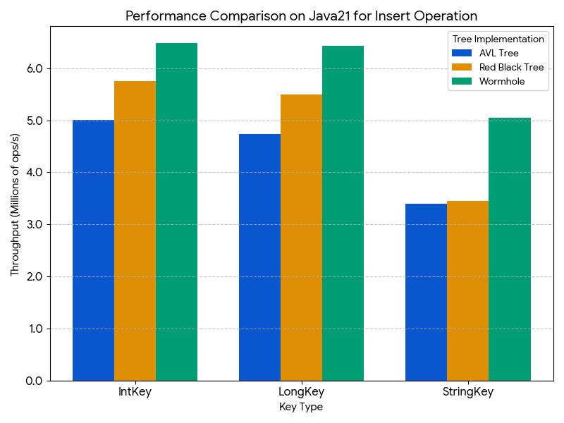
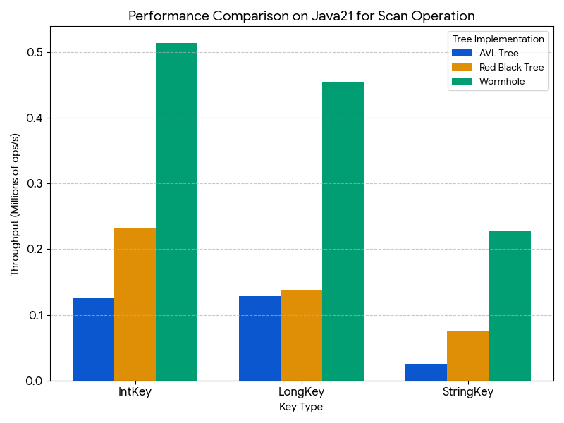

# Wormhole4j

**Wormhole4j** is a high-performance ordered in-memory index for Java, based on the research paper [*“Wormhole: A Fast Ordered Index for In-memory Data Management”*](https://dl.acm.org/doi/10.1145/3302424.3303955).
It is designed for workloads that require extremely fast point lookups and efficient ordered scans, while also supporting fast inserts and deletes.

## Features

* Supports `put()`, `get()`, `scan()`, and `delete()` operations for Integer, Long, and String keys
* **[Significantly faster](#benchmark-result) `scan()` API** for full scans, prefix scans, and range scans (inclusive/exclusive) - 2-10x faster than tree-based alternatives
* **[Excellent performance](#benchmark-result) for String keys** - 25-63% faster get/put operations than tree-based structures
* Competitive `get()` and `put()` performance with optimized tree structures for numeric keys

## Current limitations

* Not thread-safe

## Installation

### Maven

Add the following to your `pom.xml`:

```xml
<dependency>
    <groupId>org.komamitsu</groupId>
    <artifactId>wormhole4j</artifactId>
    <version>0.2.0</version>
</dependency>
```

### Gradle (Groovy DSL)

Add the following to your `build.gradle`:

```groovy
implementation 'org.komamitsu:wormhole4j:0.2.0'
```

### Gradle (Kotlin DSL)

Add the following to your `build.gradle.kts`:

```kotlin
implementation("org.komamitsu:wormhole4j:0.2.0")
```

## Quick Start

```java
// Example with String keys
WormholeForStringKey<String> wormholeStr = new WormholeForStringKey<>();
wormholeStr.put("James", "semaj");
wormholeStr.put("Joseph", "hpesoj");
wormholeStr.put("John", "nhoj");
wormholeStr.put("Jacob", "bocaj");
wormholeStr.put("Jason", "nosaj");
String value = wormholeStr.get("James"); // returns "semaj"

// Prefix scan
List<KeyValue<String, String>> prefixScanResult = wormholeStr.scanWithCount("Ja", 3);

// Range scan (exclusive end)
List<KeyValue<String, String>> rangeScanResult = new ArrayList<>();
wormholeStr.scan("Ja", "Joseph", true, (k, v) -> {
  rangeScanResult.add(new KeyValue<>(k, v));
  if (k.equals("Jojo")) {
    // Return false to stop the scan.
    return false;
  }
  // Return true to continue the scan.
  return true;
});

// Delete a record
wormholeStr.delete("James");

// Example with Integer keys
WormholeForIntKey<String> wormholeInt = new WormholeForIntKey<>();
wormholeInt.put(100, "hundred");

// Example with Long keys
WormholeForLongKey<String> wormholeLong = new WormholeForLongKey<>();
wormholeLong.put(9000000000L, "nine billion");
```

## Benchmark Result

The performance of Wormhole4j was evaluated against well-known sorted map implementations.








### Benchmark Configuration

- **Record count:** 100,000 records
- **Operations measured:**
  - INSERT: 100,000 operations (inserting all records into an empty map)
  - GET: 100,000 operations (random lookups from a populated map)
  - SCAN: 10,000 operations (range scans with scan size of 512 records)
- **Key types tested:** Integer, Long, and String
  - String keys: length range 32-256 characters
- **JVM versions:** Java 8 and Java 21

### Comparison Targets

- `java.util.TreeMap` - Red-Black tree from Java standard library
- `it.unimi.dsi.fastutil.objects.Object2ObjectAVLTreeMap` - AVL tree from `it.unimi.dsi:fastutil:8.5.16`

## Future Plans

* **Thread safety** – Provide a thread-safe version for concurrent access.
* **Persistence support** – Add an optional persistent variant of Wormhole.
* **Further optimization**

## License

Apache License 2.0.
