# Wormhole4j

**Wormhole4j** is a high-performance sorted map for Java 8 or later, based on the research paper [*"Wormhole: A Fast Ordered Index for In-memory Data Management"*](https://dl.acm.org/doi/10.1145/3302424.3303955).

## Features

* Supports `put()`, `get()`, `scan()`, `scanWithCount()`, `snapshotScan()`, and `delete()` operations for Integer, Long, and String keys
* **[Significantly faster](#benchmark-result) `scan()` API** for range scans (inclusive/exclusive) - 2x-4x faster than tree-based alternatives
* **[Excellent performance](#benchmark-result) for String keys** - about 40% faster `get()`/`put()` operations than tree-based alternatives
* **[Thread-safe concurrent access](#concurrent-usage)** via `setConcurrent(true)` in the builder - outperforms `ConcurrentSkipListMap` for `put()`+`get()` workloads and String key scans; trade-off on concurrent numeric key scans

## Installation

### Maven

Add the following to your `pom.xml`:

```xml
<dependency>
    <groupId>org.komamitsu</groupId>
    <artifactId>wormhole4j</artifactId>
    <version>0.3.1</version>
</dependency>
```

### Gradle (Groovy DSL)

Add the following to your `build.gradle`:

```groovy
implementation 'org.komamitsu:wormhole4j:0.3.1'
```

### Gradle (Kotlin DSL)

Add the following to your `build.gradle.kts`:

```kotlin
implementation("org.komamitsu:wormhole4j:0.3.1")
```

## Quick Start

```java
// Example with String keys
Wormhole<String, String> wormholeStr = new WormholeBuilder.ForStringKey<String>().build();
String existingValue = wormholeStr.put("James", "semaj"); // returns null
wormholeStr.put("Joseph", "hpesoj");
wormholeStr.put("John", "nhoj");
wormholeStr.put("Jacob", "bocaj");
wormholeStr.put("Jason", "nosaj");
String value = wormholeStr.get("James"); // returns "semaj"

// Prefix scan
List<KeyValue<String, String>> prefixScanResult = wormholeStr.scanWithCount("Ja", 3);

// Range scan (exclusive end) with a callback
wormholeStr.scan("Ja", "Joseph", true, (k, v) -> {
  /*
  if (k.equals("unexpected_key")) {
    // If you want to stop the scan, return false.
    return false;
  }
  */
  return true;
});

// Range scan (exclusive end) returning a list
List<KeyValue<String, String>> rangeScanResult = wormholeStr.scan("Ja", "Joseph", true);

// Delete a record
String deletedValue = wormholeStr.delete("James"); // returns "semaj"

// Example with Integer keys
Wormhole<Integer, String> wormholeInt = new WormholeBuilder.ForIntKey<String>().build();
wormholeInt.put(100, "hundred");

// Example with Long keys
Wormhole<Long, String> wormholeLong = new WormholeBuilder.ForLongKey<String>().build();
wormholeLong.put(9000000000L, "nine billion");
```

## Concurrent Usage

When using Wormhole from multiple threads, enable concurrent mode via the builder.
Each thread must call `registerThread()` before accessing the Wormhole and `unregisterThread()` when done.

```java
Wormhole<String, String> wormhole = new WormholeBuilder.ForStringKey<String>()
    .setConcurrent(true)
    .build();

ExecutorService executor = Executors.newFixedThreadPool(2);
try {
    // Thread 1
    executor.submit(() -> {
        wormhole.registerThread();
        try {
            wormhole.put("James", "semaj");
            wormhole.put("Joseph", "hpesoj");
            wormhole.put("John", "nhoj");
        } finally {
            wormhole.unregisterThread();
        }
    });

    // Thread 2
    executor.submit(() -> {
        wormhole.registerThread();
        try {
            String value = wormhole.get("James"); // returns "semaj" if the put() operation has completed, otherwise null

            // Use snapshotScan() for a consistent snapshot across all scanned records
            List<KeyValue<String, String>> snapshot = wormhole.snapshotScan("James", "Joseph", true);
        } finally {
            wormhole.unregisterThread();
        }
    });
} finally {
    executor.shutdown();
    executor.awaitTermination(60, TimeUnit.SECONDS);
}
```

## Benchmark Result

### Single-thread

The performance of Wormhole4j was evaluated against well-known sorted map implementations.

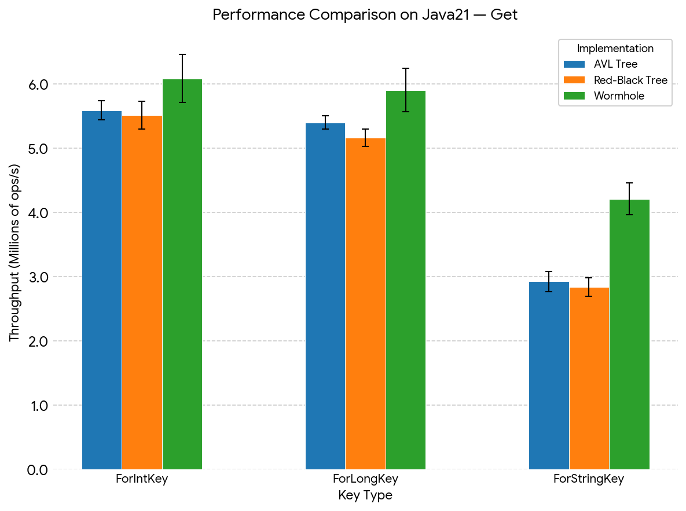
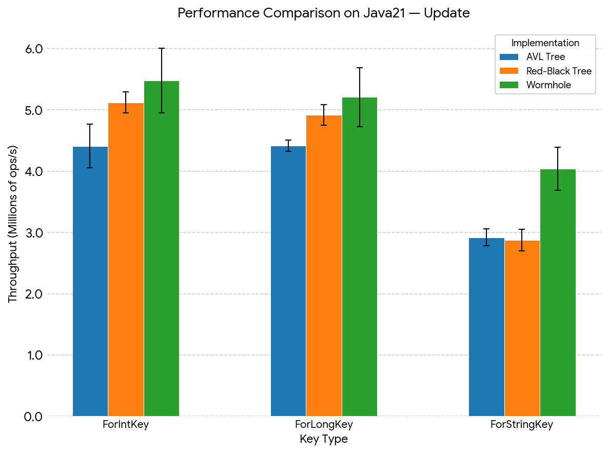
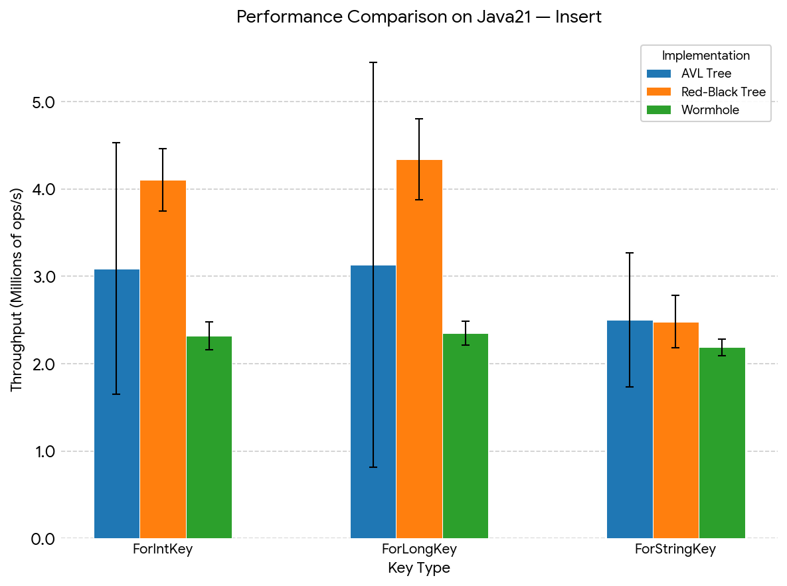
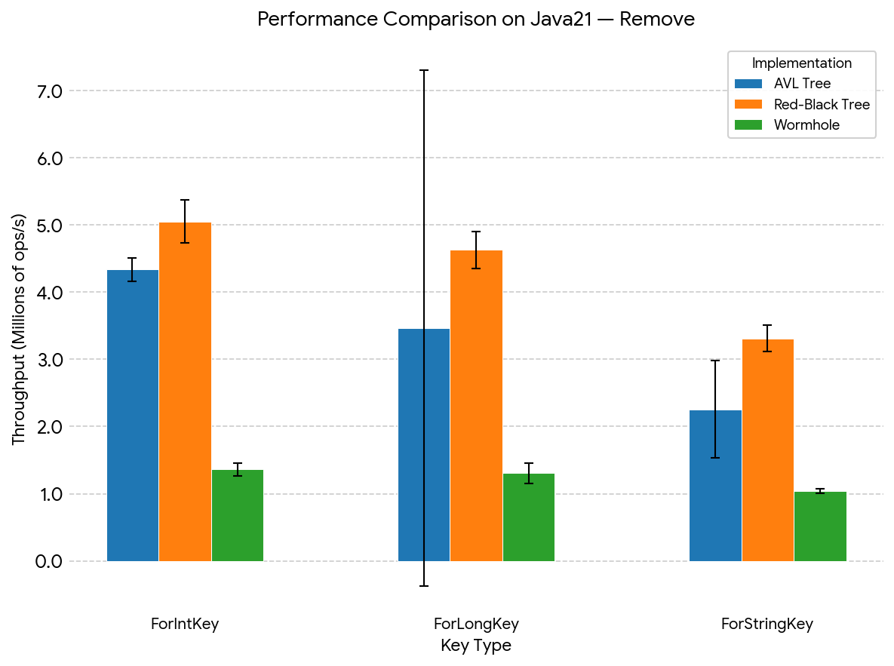
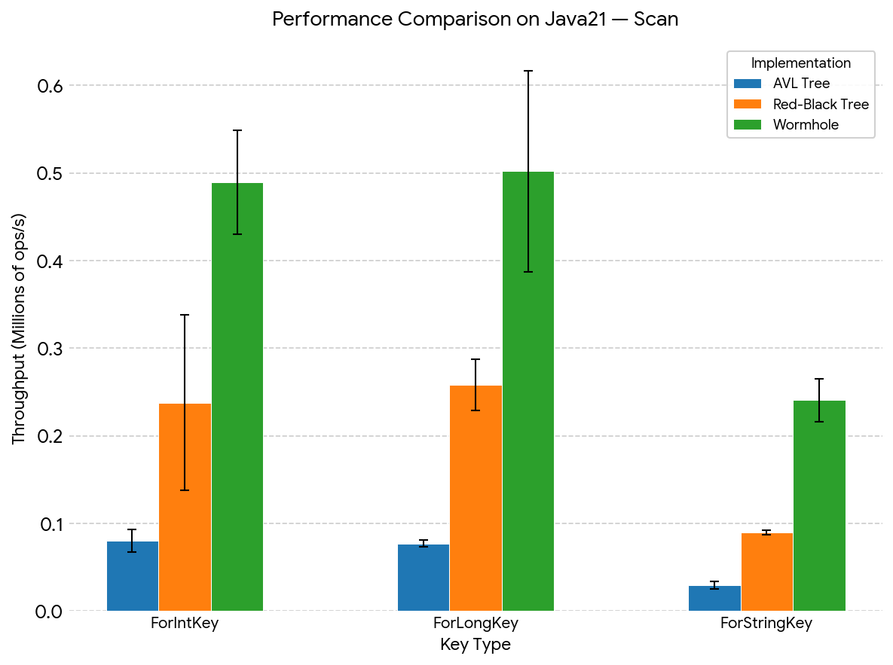

#### Benchmark Configuration

- **Record count:** 100,000 records
- **Operations measured:**
  - GET: 10 second operations
  - UPDATE: 10 second operations
  - INSERT: 100,000 operations
  - REMOVE: 100,000 operations
  - SCAN: 10 second operations (range scans with scan size of 512 records)
- **Key types tested:** Integer, Long, and String
  - String keys: length range 32-256 characters
- **JVM version:** Java 21

#### Comparison Targets

- `java.util.TreeMap` - Red-Black tree from Java standard library
- `it.unimi.dsi.fastutil.objects.Object2ObjectAVLTreeMap` - AVL tree from `it.unimi.dsi:fastutil:8.5.16`

#### Key Findings

**SCAN** is Wormhole's strongest suit: up to 4x faster than the AVL tree and 2x faster than `TreeMap` for numeric keys. This reflects the core advantage of Wormhole's linked leaf node structure for range traversal.

**String key GET/UPDATE** is about 40% faster than both tree implementations, likely due to Wormhole's hash-table-based Trie and the indexes in a leaf node, which allow it to exploit common key prefixes and avoid redundant character comparisons.

**REMOVE** is slower than both tree implementations. There might be room to improve. However, this performance characteristic appears to be inherent to Wormhole's leaf node design.

### Multi-thread

The concurrent performance of Wormhole4j was evaluated with simultaneous read and write operations across varying thread counts.

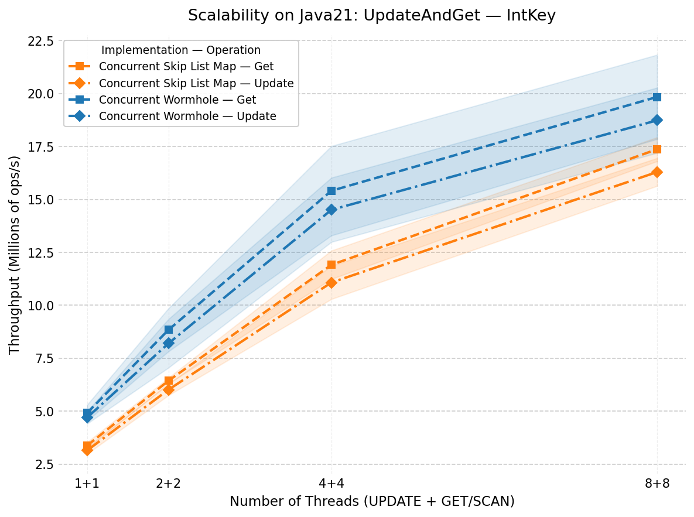
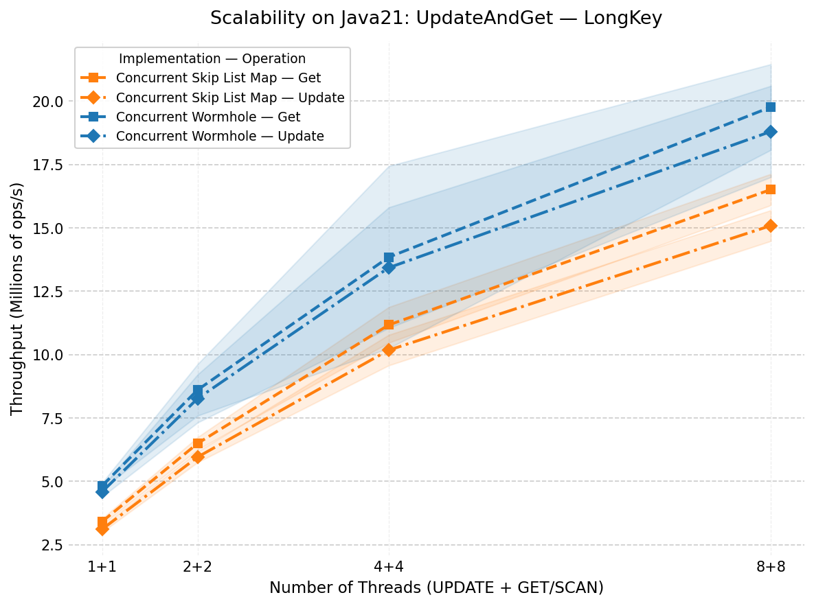
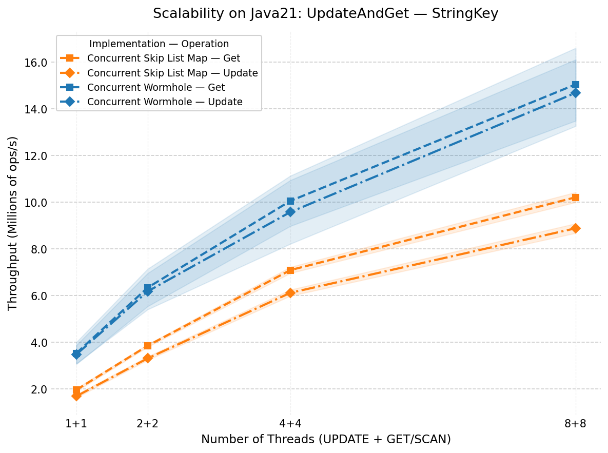
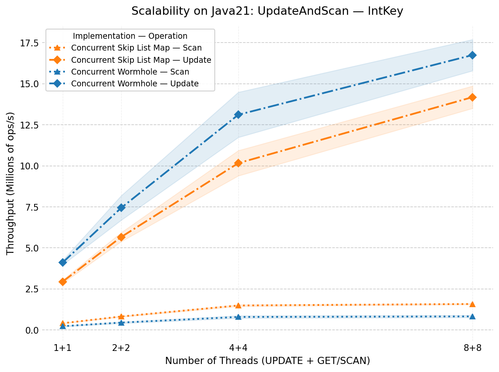
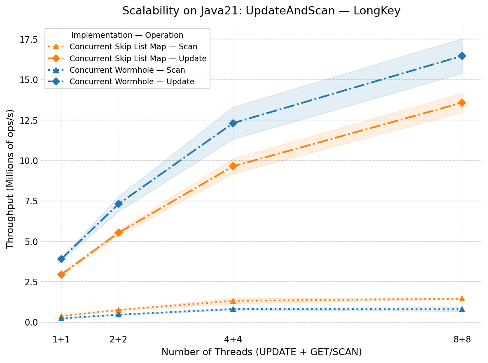
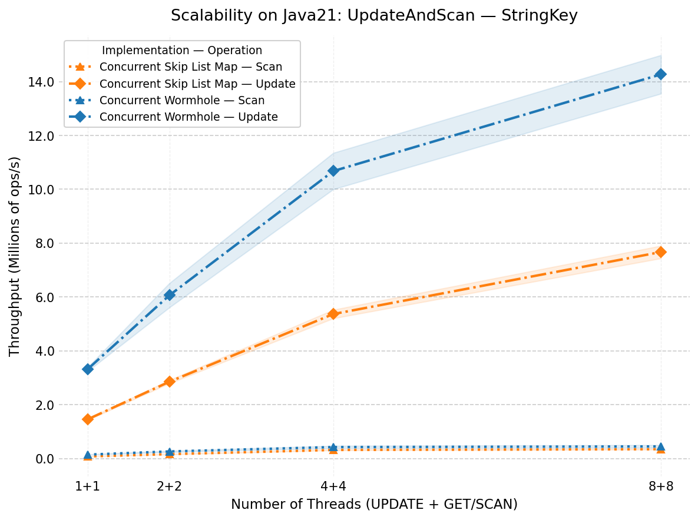

#### Benchmark Configuration

- **Record count:** 100,000 records
- **Scenarios:** N UPDATE threads and N GET (or SCAN) threads running concurrently, where N = 1, 2, 4, 8
- **Key types tested:** Integer, Long, and String
  - String keys: length range 32-256 characters
- **JVM version:** Java 21

#### Comparison Target

- `java.util.concurrent.ConcurrentSkipListMap` - Concurrent sorted map from Java standard library

#### Key Findings

**UPDATE + GET:** Wormhole consistently outperforms `ConcurrentSkipListMap` across all thread counts and key types. The advantage is largest for String keys (up to 2x faster at 1+1 threads, 56% faster at 8+8) and solid for numeric keys (15-48% faster depending on thread count).

**UPDATE + SCAN (UPDATE throughput):** Similarly strong gains, especially for String keys (up to 2.3x faster UPDATE at 1+1 threads, 84% faster combined at 8+8).

**UPDATE + SCAN (SCAN throughput):** Results are mixed. For String keys, Wormhole is faster across all thread counts (30-89%). For Integer and Long keys, `ConcurrentSkipListMap` has a SCAN advantage (38-48% faster) under concurrent write pressure — a trade-off to be aware of for scan-heavy workloads with numeric keys.

**Scalability:** Both implementations scale roughly linearly from 1+1 to 4+4 threads (around 3x throughput gain) and flatten similarly beyond that. Wormhole's throughput advantage is maintained at all tested thread counts.

## Future Plans

* **Persistence support** – Add an optional persistent variant of Wormhole.
* **Further optimization**

## License

Apache License 2.0.
