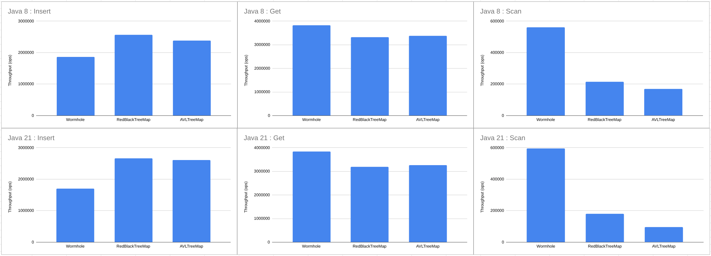

# Wormhole4j

**Wormhole4j** is a high-performance ordered in-memory index for Java, based on the research paper [*“Wormhole: A Fast Ordered Index for In-memory Data Management”*](https://dl.acm.org/doi/10.1145/3302424.3303955).
It is designed for workloads that require extremely fast point lookups and efficient ordered scans, while also supporting fast inserts and deletes.

## Features

* **[Extremely fast](#benchmark-result) `scan()` API** for full scans, prefix scans, and range scans (inclusive/exclusive)
* **[Ultra-fast](#benchmark-result) `get()` API** for point lookups
* Fast `put()` and `delete()` operations

## Current limitations

* Supports only `String` keys
* Not thread-safe

## Installation

### Maven

Add the following to your `pom.xml`:

```xml
<dependency>
    <groupId>org.komamitsu</groupId>
    <artifactId>wormhole4j</artifactId>
    <version>0.1.0</version>
</dependency>
```

### Gradle (Groovy DSL)

Add the following to your `build.gradle`:

```groovy
implementation 'org.komamitsu:wormhole4j:0.1.0'
```

### Gradle (Kotlin DSL)

Add the following to your `build.gradle.kts`:

```kotlin
implementation("org.komamitsu:wormhole4j:0.1.0")
```

## Quick Start

```java
// Create an index with the default settings
Wormhole<String> wormhole = new Wormhole<>();

// Insert a record
wormhole.put("James", "semaj");

// Get a record
String value = wormhole.get("James"); // returns "semaj"

// Prefix scan
List<KeyValue<String>> prefixResults = wormhole.scanWithCount("Jam", 3);

// Range scan (exclusive end)
List<KeyValue<String>> rangeResults = new ArrayList<>();
wormhole.scanWithExclusiveEndKey("James", "John", rangeResults::add);

// Range scan (inclusive end)
wormhole.scanWithInclusiveEndKey("James", "John", rangeResults::add);

// Delete a record
wormhole.delete("James");
```

## Benchmark result

The performance of our library was evaluated against several well-known sorted map implementations to provide a comprehensive comparison.



The benchmark was conducted with the following condition:
- The number of records was 100K.
- The max key length was 128 and the average key length was 64.
- The max scan record size was 512 and the average scan record size was 256.

It used other sorted maps for comparison as follows:
- `java.util.TreeMap` as a Red-Black tree map from the standard library.
- `it.unimi.dsi.fastutil.objects.Object2ObjectAVLTreeMap` as an AVL tree map from `it.unimi.dsi:fastutil:8.5.16`

## Future Plans

* **Further optimization**
* **Persistence support** – Add an optional persistent variant of Wormhole.
* **Thread safety** – Provide a thread-safe version for concurrent access.

## License

Apache License 2.0.
